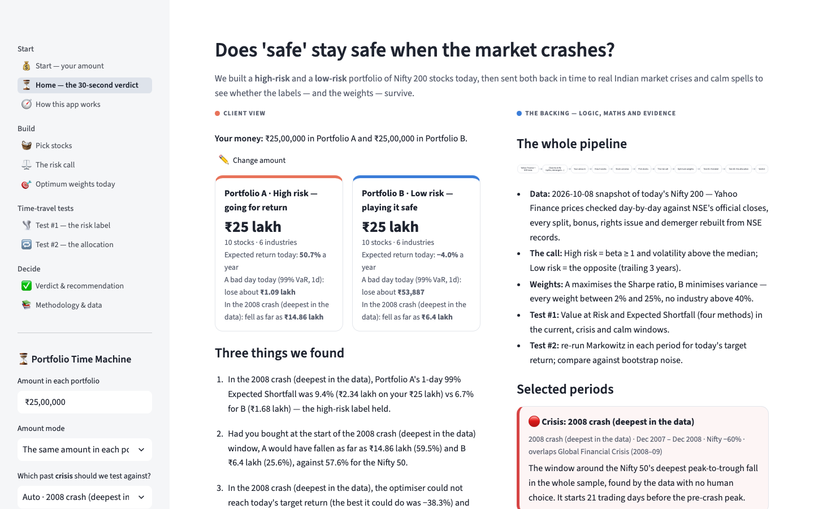
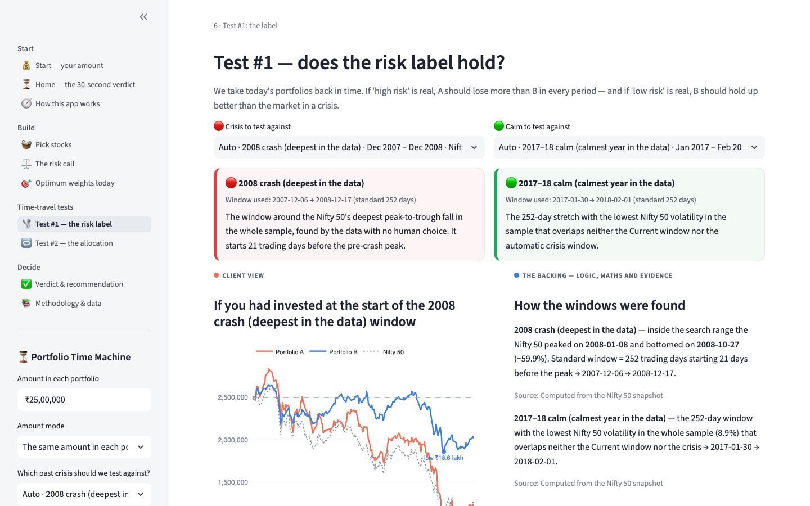
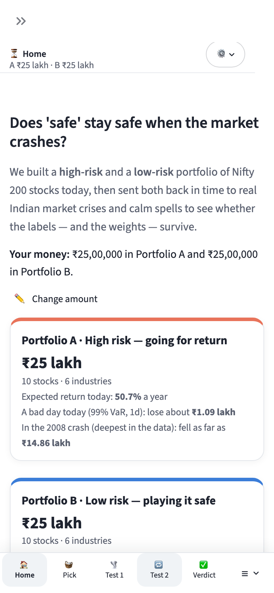

# ⏳ Portfolio Time Machine

**Live site → https://anuyeshsinha7-ui.github.io/portfolio-time-machine/**

[](https://github.com/anuyeshsinha7-ui/portfolio-time-machine/actions/workflows/deploy.yml)

*Does 'safe' stay safe when the market crashes?*

* Two portfolios from today's Nifty 200: **A — high risk** (beta ≥ 1, volatility above the median) and **B — low risk**; 10 stocks each, no overlap.
* **Time-travel test #1:** Value at Risk and Expected Shortfall (four methods) for both, in a historical crisis, a calm spell and today — did the labels hold?
* **Time-travel test #2:** re-run Markowitz with each period's data for today's target return — would the optimiser still pick our weights, or is the difference just estimation noise?

Everything is shown in rupees on the amount you choose, with the maths alongside ("The Backing"). It works on a phone like an app.

| Home (desktop) | Test #1 (desktop) | Phone |
|---|---|---|
|  |  |  |

## Headline results (snapshot 8 Oct 2026, ₹15 lakh in each)

See [docs/RESULTS_SUMMARY.md](docs/RESULTS_SUMMARY.md) for every number, including the all-events scoreboard.

## Run it

```bash
conda create -n fra python=3.13 && conda activate fra
pip install -r requirements.txt
streamlit run app.py
```

The deployed site runs the *same* `app.py` in the browser with [stlite](https://github.com/whitphx/stlite) (Streamlit on Pyodide) — no server.
Tests: `pip install -r requirements-dev.txt && pytest` (browser smoke test: `python scripts/build_site.py && python tests/e2e_site.py`).

## Method in brief

* **Labels** from the trailing 3 years (beta to the Nifty 50, annualised volatility); evidence = weighted beta, √(wᵀΣw), drawdown, correlation, and a block-bootstrap CI for σA/σB.
* **Weights:** A maximises the Sharpe ratio, B minimises variance; 2%–25% per stock, ≤ 40% per industry; SciPy SLSQP, cross-checked against cvxpy.
* **Regimes:** 252-day windows anchored on the Nifty 50 data — the deepest drawdown (2008) and the calmest year (2017–18) by default, plus 13 catalogue events in a dropdown.
* **Risk:** historical, normal, Student-t Monte Carlo and Cornish–Fisher VaR/ES; Kupiec breach test; buy-and-hold ₹ crisis replay.
* Full details: [docs/METHODOLOGY.md](docs/METHODOLOGY.md) · decisions: [DECISIONS.md](DECISIONS.md).

## Data cleaning in brief

Yahoo Finance prices (via yfinance) were **anchored to NSE's official closes** month by month, bisecting to the exact day wherever Yahoo's level jumped — 59 hidden errors in 43 stocks. Every split, bonus and rights issue was rebuilt from NSE corporate-action records; demergers use NSE's special pre-open price discovery (2023 onwards) or drop that single day's return; stale prices, bad ticks, pre-listing rows and calendar gaps were checked against NSE before any fix. 30/30 random spot checks match NSE within 1%. Report: [docs/DATA_QUALITY.md](docs/DATA_QUALITY.md).

## Stack

Python 3.13 · pandas · NumPy · SciPy · Plotly · Streamlit 1.62 · stlite 1.9.2 (Pyodide 0.29) · GitHub Pages + GitHub Actions · pytest, streamlit.testing, Playwright.

## Updating the site

* **Redeploy:** push to `main` — Actions runs the tests, precomputes, builds `_site/`, smoke-tests it in a browser and publishes.
* **Refresh the data:** locally run `python scripts/fetch_data.py --refresh` then `python scripts/clean_data.py`; review the data-quality diff (`data/restatements_vs_previous_snapshot.csv`, `docs/DATA_QUALITY.md`); run `python scripts/precompute.py && python scripts/run_analysis.py && python scripts/write_docs.py`; commit the new snapshot and push.
* **Freeze the snapshot before the presentation** so the slides, [the presentation guide](docs/PRESENTATION_GUIDE.md) and the site match.

## Team

[Name 1], [Name 2], [Name 3], [Name 4] — PGDM, Great Lakes Institute of Management, Gurgaon.

*Educational project — not investment advice. Data: Yahoo Finance (via yfinance) and NSE.*
